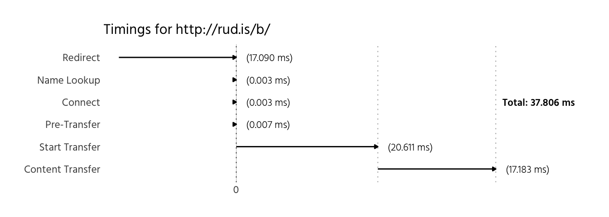
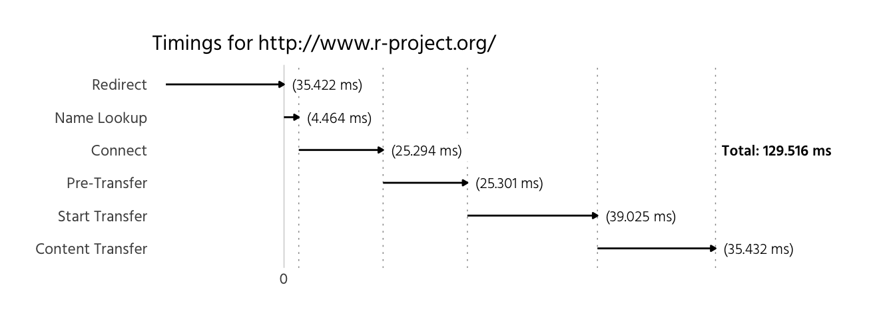
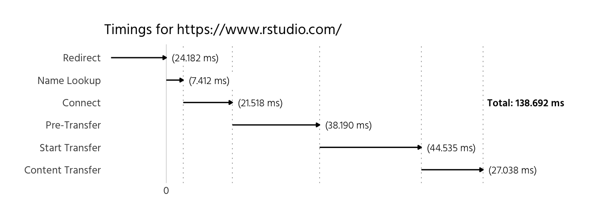

Who needs `httpstat`?
=====================

`httpstat` (whether in [Python](https://github.com/reorx/httpstat) or [Go](https://github.com/davecheney/httpstat)) is all the rage these days with those Sillycanny Valley folks. We can do *so* much better than text with R and we can work directly with what `httr` verb functions return:

``` r
library(httr)
library(purrr)
library(dplyr)
library(tidyr)
library(stringi)
library(ggplot2)
library(hrbrmisc) # devtools::install_github("hrbrmstr/hrbrmisc")

httr_stat <- function(res) {

  full_times <- c(res$times[1:5], contenttransfer=unname(res$times[6]-res$times[5]), res$times[6])
  start_pos <- c(0, unname(cumsum(c(0, full_times[2:6]))))
  end_pos <- start_pos + full_times
  stat <- c("Redirect", "Name Lookup", "Connect", "Pre-Transfer", "Start Transfer",
            "Content Transfer", "Total")

  df <- data_frame(stat, start_pos, end_pos, duration=full_times)
  df$start_pos[1] <- -df$end_pos[1]
  df$end_pos[1] <- 0
  df <- head(df, -1)

  df$stat <- factor(df$stat, levels=rev(df$stat))
  df$start_pos <- 100 * df$start_pos
  df$end_pos <- 100 * df$end_pos
  df$duration <- 100 * df$duration

  rng <- if (df$start_pos[1]<0) 1:6 else 2:6

  ggplot(head(df[rng,])) +
    geom_vline(data=df[2:6, ], aes(xintercept=end_pos), linetype="dotted", size=0.25, alpha=0.5) +
    geom_segment(aes(x=start_pos, xend=end_pos, y=stat, yend=stat),
                 arrow=arrow(ends="last", type="closed", length=unit(3, "points"))) +
    geom_label(aes(x=end_pos, y=stat, label=sprintf("(%4.3f ms)", duration)),
               hjust=0, family="Hind-Light", size=3, nudge_x=1, label.size=0) +
    geom_label(data=df[6,], aes(x=end_pos, y="Connect", label=sprintf("Total: %4.3f ms", end_pos)),
               hjust=0, family="Hind-SemiBold", size=3, nudge_x=0.5, label.size=0) +
    scale_x_continuous(expand=c(0,0.5), limits=c(df$start_pos[1]*1.1, df$end_pos[6]*1.33),
                       breaks=0, labels="0") +
    labs(x=NULL, y=NULL, title=NULL, subtitle=sprintf("Timings for %s", res$url)) +
    theme_hrbrmstr(grid="X", subtitle_family = "Hind") +
    theme(plot.subtitle=element_text(margin=margin(b=6))) -> gg

  print(gg)

  ah <- res$all_headers[[1]][[3]]
  hnam <- stri_trans_totitle(names(ah))
  hval <- flatten_chr(ah)
  ahl <- max(map_int(hnam, nchar))

  cat(sprintf("%s: %s %s\n", stri_pad_left("STATUS", ahl), res$all_headers[[1]][[2]], res$all_headers[[1]][[1]]))
  cat(sprintf("%s: %s\n", stri_pad_left(hnam, ahl), hval), sep="")

}
```

Since `httr` is configured to follow redirects, we have that data in the response and can use that in the output:

``` r
httr_stat(GET("http://rud.is/b"))
```


    ##         STATUS: HTTP/1.1 301
    ##         Server: nginx/1.11.2
    ##           Date: Sun, 02 Oct 2016 16:08:37 GMT
    ##   Content-Type: text/html
    ## Content-Length: 185
    ##       Location: http://rud.is/b/
    ##     Connection: keep-alive
    ##        Expires: Mon, 03 Oct 2016 16:08:37 GMT
    ##  Cache-Control: max-age=86400

Of course, it works fine when there aren't redirects:

``` r
httr_stat(GET("http://rud.is/b/"))
```


    ##            STATUS: HTTP/1.1 200
    ##            Server: nginx/1.11.2
    ##              Date: Sun, 02 Oct 2016 16:08:40 GMT
    ##      Content-Type: text/html; charset=UTF-8
    ## Transfer-Encoding: chunked
    ##        Connection: keep-alive
    ##              Vary: Accept-Encoding
    ##           Expires: Mon, 03 Oct 2016 16:08:40 GMT
    ##     Cache-Control: max-age=86400
    ##            Pragma: no-cache
    ##              Link: <https://rud.is/b/wp-json/>; rel="https://api.w.org/"
    ##              Link: <http://wp.me/23idr>; rel=shortlink
    ##  Content-Encoding: gzip

It's interesting to see how some sites are configured (and how well they perform):

``` r
httr_stat(GET("http://r-project.org/"))
```



    ##         STATUS: HTTP/1.1 301
    ##           Date: Sun, 02 Oct 2016 16:08:41 GMT
    ##         Server: Apache/2.4.10 (Debian)
    ##       Location: http://www.r-project.org/
    ## Content-Length: 312
    ##   Content-Type: text/html; charset=iso-8859-1

``` r
httr_stat(GET("http://rstudio.com/"))
```


    ##         STATUS: HTTP/1.1 302
    ##         Server: nginx
    ##           Date: Sun, 02 Oct 2016 16:08:42 GMT
    ##   Content-Type: text/html
    ## Content-Length: 154
    ##     Connection: keep-alive
    ##     Keep-Alive: timeout=20
    ##       Location: https://www.rstudio.com/

``` r
httr_stat(GET("http://github.com/"))
```



    ##         STATUS: HTTP/1.1 301
    ## Content-Length: 0
    ##       Location: https://github.com/
    ##     Connection: close

``` r
httr_stat(GET("http://stackoverflow.com/"))
```



    ##                 STATUS: HTTP/1.1 200
    ##          Cache-Control: public, max-age=49
    ##           Content-Type: text/html; charset=utf-8
    ##       Content-Encoding: gzip
    ##                Expires: Sun, 02 Oct 2016 16:09:34 GMT
    ##          Last-Modified: Sun, 02 Oct 2016 16:08:34 GMT
    ##        X-Frame-Options: SAMEORIGIN
    ##         X-Request-Guid: b104cc0b-3277-421f-8924-383829f7f4b8
    ##         Content-Length: 40609
    ##          Accept-Ranges: bytes
    ##                   Date: Sun, 02 Oct 2016 16:08:44 GMT
    ##                    Via: 1.1 varnish
    ##             Connection: keep-alive
    ##            X-Served-By: cache-bos8225-BOS
    ##                X-Cache: MISS
    ##           X-Cache-Hits: 0
    ##                X-Timer: S1475424524.806940,VS0,VE7
    ##                   Vary: *
    ## X-Dns-Prefetch-Control: off
    ##             Set-Cookie: prov=43a14559-98e3-fbec-8ae6-fb6f5201f5e8; domain=.stackoverflow.com; expires=Fri, 01-Jan-2055 00:00:00 GMT; path=/; HttpOnly
