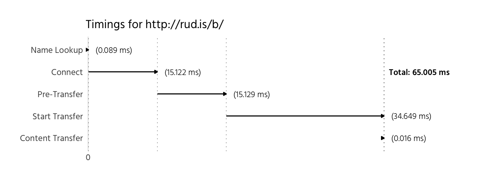

Who needs `httpstat`?
=====================

`httpstat` (whether in [Python](https://github.com/reorx/httpstat) or [Go](https://github.com/davecheney/httpstat)) is all the rage these days with those Sillycanny Valley folks. We can do *so* much better than text with R and we can work directly with what `httr` verb functions return:

``` r
library(httr)
library(curl)
library(purrr)
library(dplyr)
library(tidyr)
library(stringi)
library(ggplot2)
library(hrbrmisc) # devtools::install_github("hrbrmstr/hrbrmisc")

httr_stat <- function(res) {
  
  if ("redirect" %notin% names(res$times)) {
    res$times <- c(redirect=0.00, res$times)
  }
  
  full_times <- c(res$times[1:5], contenttransfer=unname(res$times[6]-res$times[5]), res$times[6])
  start_pos <- c(0, unname(cumsum(c(0, full_times[2:6]))))
  end_pos <- start_pos + full_times
  stat <- c("Redirect", "Name Lookup", "Connect", "Pre-Transfer", "Start Transfer",
            "Content Transfer", "Total")
  
  df <- data_frame(stat, start_pos, end_pos, duration=full_times)
  
  df$start_pos[1] <- -df$end_pos[1]
  df$end_pos[1] <- 0
  df <- head(df, -1)
  
  df$stat <- factor(df$stat, levels=rev(df$stat))
  df$start_pos <- 100 * df$start_pos
  df$end_pos <- 100 * df$end_pos
  df$duration <- 100 * df$duration
  
  rng <- if (df$start_pos[1]<0) 1:6 else 2:6
  
  lims <- c(df$start_pos[1]*1.1, df$end_pos[6]*1.33)
  if (df$start_pos>0) lims[1] <- -0.5
  
  ggplot(head(df[rng,])) +
    geom_vline(data=df[2:6, ], aes(xintercept=end_pos), linetype="dotted", size=0.25, alpha=0.5) +
    geom_segment(aes(x=start_pos, xend=end_pos, y=stat, yend=stat),
                 arrow=arrow(ends="last", type="closed", length=unit(3, "points"))) +
    geom_label(aes(x=end_pos, y=stat, label=sprintf("(%4.3f ms)", duration)),
               hjust=0, family="Hind-Light", size=3, nudge_x=1, label.size=0) +
    geom_label(data=df[6,], aes(x=end_pos, y="Connect", 
                                label=sprintf("Total: %4.3f ms", end_pos)),
               hjust=0, family="Hind-SemiBold", size=3, nudge_x=0.5, label.size=0) +
    scale_x_continuous(expand=c(0,0.5), limits=lims, breaks=0, labels="0") +
    labs(x=NULL, y=NULL, title=NULL, subtitle=sprintf("Timings for %s", res$url)) +
    theme_hrbrmstr(grid="X", subtitle_family = "Hind") +
    theme(plot.subtitle=element_text(margin=margin(b=6))) -> gg
  
  print(gg)
  
  if (inherits(res, "response")) {
    
    walk(res$all_headers, function(x) {
      
      ah <- x[[3]]
      hnam <- stri_trans_totitle(names(ah))
      hval <- flatten_chr(ah)
      ahl <- max(map_int(hnam, nchar))
      
      cat(sprintf("%s: %s %s\n", stri_pad_left("STATUS", ahl), x[[2]], x[[1]]))
      cat(sprintf("%s: %s\n", stri_pad_left(hnam, ahl), hval), sep="")
      cat("\n", sep="")
      
    })
    
  } else {
    
    cat(rawToChar(res$headers), sep="")
    
  }
  
}
```

Since `httr` is configured to follow redirects, we have that data in the response and can use that in the output:

``` r
httr_stat(GET("http://rud.is/b"))
```


    ##         STATUS: HTTP/1.1 301
    ##         Server: nginx/1.11.2
    ##           Date: Sun, 02 Oct 2016 20:53:38 GMT
    ##   Content-Type: text/html
    ## Content-Length: 185
    ##       Location: http://rud.is/b/
    ##     Connection: keep-alive
    ##        Expires: Mon, 03 Oct 2016 20:53:38 GMT
    ##  Cache-Control: max-age=86400
    ## 
    ##            STATUS: HTTP/1.1 200
    ##            Server: nginx/1.11.2
    ##              Date: Sun, 02 Oct 2016 20:53:39 GMT
    ##      Content-Type: text/html; charset=UTF-8
    ## Transfer-Encoding: chunked
    ##        Connection: keep-alive
    ##              Vary: Accept-Encoding
    ##        Set-Cookie: PHPSESSID=0t1obj6kqia59e559s8a2vaqn2; path=/
    ##           Expires: Mon, 03 Oct 2016 20:53:39 GMT
    ##     Cache-Control: max-age=86400
    ##            Pragma: no-cache
    ##              Link: <https://rud.is/b/wp-json/>; rel="https://api.w.org/"
    ##              Link: <http://wp.me/23idr>; rel=shortlink
    ##  Content-Encoding: gzip

Of course, it works fine when there aren't redirects:

``` r
httr_stat(GET("http://rud.is/b/"))
```


    ##            STATUS: HTTP/1.1 200
    ##            Server: nginx/1.11.2
    ##              Date: Sun, 02 Oct 2016 20:53:41 GMT
    ##      Content-Type: text/html; charset=UTF-8
    ## Transfer-Encoding: chunked
    ##        Connection: keep-alive
    ##              Vary: Accept-Encoding
    ##           Expires: Mon, 03 Oct 2016 20:53:41 GMT
    ##     Cache-Control: max-age=86400
    ##            Pragma: no-cache
    ##              Link: <https://rud.is/b/wp-json/>; rel="https://api.w.org/"
    ##              Link: <http://wp.me/23idr>; rel=shortlink
    ##  Content-Encoding: gzip

And, it also works on raw `curl` requests:

``` r
httr_stat(curl_fetch_memory("http://rud.is/b"))
```


    ## HTTP/1.1 301 Moved Permanently
    ## Server: nginx/1.11.2
    ## Date: Sun, 02 Oct 2016 20:53:42 GMT
    ## Content-Type: text/html
    ## Content-Length: 185
    ## Location: http://rud.is/b/
    ## Connection: keep-alive
    ## Expires: Mon, 03 Oct 2016 20:53:42 GMT
    ## Cache-Control: max-age=86400
    ## 
    ## HTTP/1.1 200 OK
    ## Server: nginx/1.11.2
    ## Date: Sun, 02 Oct 2016 20:53:42 GMT
    ## Content-Type: text/html; charset=UTF-8
    ## Transfer-Encoding: chunked
    ## Connection: keep-alive
    ## Vary: Accept-Encoding
    ## Set-Cookie: PHPSESSID=mqngkv21l1i1evcf8oi3598vi7; path=/
    ## Expires: Mon, 03 Oct 2016 20:53:42 GMT
    ## Cache-Control: max-age=86400
    ## Pragma: no-cache
    ## Link: <https://rud.is/b/wp-json/>; rel="https://api.w.org/"
    ## Link: <http://wp.me/23idr>; rel=shortlink
    ## Content-Encoding: gzip
    ## 

``` r
httr_stat(curl_fetch_memory("http://rud.is/b/"))
```



    ## HTTP/1.1 200 OK
    ## Server: nginx/1.11.2
    ## Date: Sun, 02 Oct 2016 20:53:43 GMT
    ## Content-Type: text/html; charset=UTF-8
    ## Transfer-Encoding: chunked
    ## Connection: keep-alive
    ## Vary: Accept-Encoding
    ## Set-Cookie: PHPSESSID=g0lv0ptm182pe87kbpa24eev53; path=/
    ## Expires: Mon, 03 Oct 2016 20:53:43 GMT
    ## Cache-Control: max-age=86400
    ## Pragma: no-cache
    ## Link: <https://rud.is/b/wp-json/>; rel="https://api.w.org/"
    ## Link: <http://wp.me/23idr>; rel=shortlink
    ## Content-Encoding: gzip
    ## 

It's interesting to see how some sites are configured (and how well they perform):

``` r
httr_stat(GET("http://r-project.org/"))
```


    ##         STATUS: HTTP/1.1 301
    ##           Date: Sun, 02 Oct 2016 20:53:43 GMT
    ##         Server: Apache/2.4.10 (Debian)
    ##       Location: http://www.r-project.org/
    ## Content-Length: 312
    ##   Content-Type: text/html; charset=iso-8859-1
    ## 
    ##           STATUS: HTTP/1.1 200
    ##             Date: Sun, 02 Oct 2016 20:53:44 GMT
    ##           Server: Apache/2.4.10 (Debian)
    ##    Last-Modified: Wed, 07 Sep 2016 15:10:02 GMT
    ##             Etag: "1694-53bec4eb368d4-gzip"
    ##    Accept-Ranges: bytes
    ##             Vary: Accept-Encoding
    ## Content-Encoding: gzip
    ##   Content-Length: 2139
    ##     Content-Type: text/html

``` r
httr_stat(GET("http://rstudio.com/"))
```


    ##         STATUS: HTTP/1.1 302
    ##         Server: nginx
    ##           Date: Sun, 02 Oct 2016 20:53:44 GMT
    ##   Content-Type: text/html
    ## Content-Length: 154
    ##     Connection: keep-alive
    ##     Keep-Alive: timeout=20
    ##       Location: https://www.rstudio.com/
    ## 
    ##            STATUS: HTTP/1.1 200
    ##            Server: nginx
    ##              Date: Sun, 02 Oct 2016 20:53:45 GMT
    ##      Content-Type: text/html; charset=UTF-8
    ## Transfer-Encoding: chunked
    ##        Connection: keep-alive
    ##        Keep-Alive: timeout=20
    ##        X-Pingback: https://www.rstudio.com/xmlrpc.php
    ##              Link: <https://www.rstudio.com/wp-json/>; rel="https://api.w.org/"
    ##              Link: <https://www.rstudio.com/>; rel=shortlink
    ##       X-Cacheable: SHORT
    ##              Vary: Accept-Encoding,Cookie
    ##     Cache-Control: max-age=600, must-revalidate
    ##           X-Cache: HIT: 49
    ##        X-Pass-Why: 
    ##     X-Cache-Group: normal
    ##            X-Type: default
    ##  Content-Encoding: gzip

``` r
httr_stat(GET("http://github.com/"))
```


    ##         STATUS: HTTP/1.1 301
    ## Content-Length: 0
    ##       Location: https://github.com/
    ##     Connection: close
    ## 
    ##                    STATUS: HTTP/1.1 200
    ##                    Server: GitHub.com
    ##                      Date: Sun, 02 Oct 2016 20:53:46 GMT
    ##              Content-Type: text/html; charset=utf-8
    ##         Transfer-Encoding: chunked
    ##                    Status: 200 OK
    ##             Cache-Control: no-cache
    ##                      Vary: X-PJAX
    ##           X-Ua-Compatible: IE=Edge,chrome=1
    ##                Set-Cookie: logged_in=no; domain=.github.com; path=/; expires=Thu, 02 Oct 2036 20:53:46 -0000; secure; HttpOnly
    ##                Set-Cookie: _gh_sess=eyJzZXNzaW9uX2lkIjoiMDU3NDA4OGNhMWJkYmRjNDQzNGJhYWQzZjBmYzhhNzMiLCJfY3NyZl90b2tlbiI6ImFNWlRQY0tuVi9MN1BhZVNQZVc1WkYvV0h6WndrOER6R2laUkdIQzI1Z1U9In0%3D--cd0f55afcaf08c59104b943e5a43eee7b7479d57; path=/; secure; HttpOnly
    ##              X-Request-Id: 530b9668015501798f72ddcec7c46ca7
    ##                 X-Runtime: 0.010891
    ##   Content-Security-Policy: default-src 'none'; base-uri 'self'; block-all-mixed-content; child-src render.githubusercontent.com; connect-src 'self' uploads.github.com status.github.com api.github.com www.google-analytics.com github-cloud.s3.amazonaws.com wss://live.github.com; font-src assets-cdn.github.com; form-action 'self' github.com gist.github.com; frame-ancestors 'none'; frame-src render.githubusercontent.com; img-src 'self' data: assets-cdn.github.com identicons.github.com collector.githubapp.com github-cloud.s3.amazonaws.com *.githubusercontent.com; media-src 'none'; script-src assets-cdn.github.com; style-src 'unsafe-inline' assets-cdn.github.com
    ## Strict-Transport-Security: max-age=31536000; includeSubdomains; preload
    ##           Public-Key-Pins: max-age=5184000; pin-sha256="WoiWRyIOVNa9ihaBciRSC7XHjliYS9VwUGOIud4PB18="; pin-sha256="RRM1dGqnDFsCJXBTHky16vi1obOlCgFFn/yOhI/y+ho="; pin-sha256="k2v657xBsOVe1PQRwOsHsw3bsGT2VzIqz5K+59sNQws="; pin-sha256="K87oWBWM9UZfyddvDfoxL+8lpNyoUB2ptGtn0fv6G2Q="; pin-sha256="IQBnNBEiFuhj+8x6X8XLgh01V9Ic5/V3IRQLNFFc7v4="; pin-sha256="iie1VXtL7HzAMF+/PVPR9xzT80kQxdZeJ+zduCB3uj0="; pin-sha256="LvRiGEjRqfzurezaWuj8Wie2gyHMrW5Q06LspMnox7A="; includeSubDomains
    ##    X-Content-Type-Options: nosniff
    ##           X-Frame-Options: deny
    ##          X-Xss-Protection: 1; mode=block
    ##                      Vary: Accept-Encoding
    ##               X-Served-By: 44f77bef9757b092723b0a6870733b02
    ##          Content-Encoding: gzip
    ##       X-Github-Request-Id: 32FCE916:10FBE:3C954D4:57F173D9

``` r
httr_stat(GET("http://stackoverflow.com/"))
```


    ##                 STATUS: HTTP/1.1 200
    ##          Cache-Control: public, max-age=14
    ##           Content-Type: text/html; charset=utf-8
    ##       Content-Encoding: gzip
    ##                Expires: Sun, 02 Oct 2016 20:54:00 GMT
    ##          Last-Modified: Sun, 02 Oct 2016 20:53:00 GMT
    ##        X-Frame-Options: SAMEORIGIN
    ##         X-Request-Guid: 71ab8e58-80cb-47d7-88f7-da96a232eb8e
    ##         Content-Length: 40232
    ##          Accept-Ranges: bytes
    ##                   Date: Sun, 02 Oct 2016 20:53:46 GMT
    ##                    Via: 1.1 varnish
    ##             Connection: keep-alive
    ##            X-Served-By: cache-bos8223-BOS
    ##                X-Cache: MISS
    ##           X-Cache-Hits: 0
    ##                X-Timer: S1475441626.747696,VS0,VE13
    ##                   Vary: *
    ## X-Dns-Prefetch-Control: off
    ##             Set-Cookie: prov=907a5b1a-bcef-fff8-af56-7f361284a54f; domain=.stackoverflow.com; expires=Fri, 01-Jan-2055 00:00:00 GMT; path=/; HttpOnly
